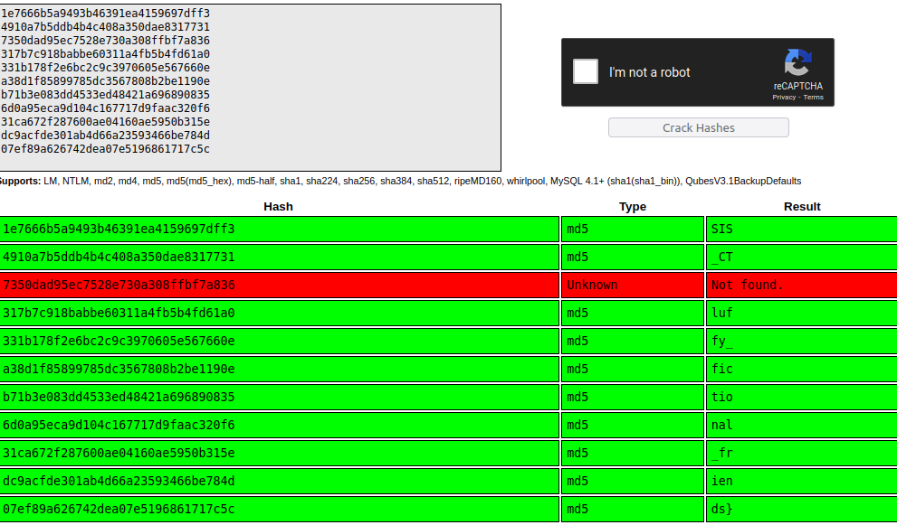

# Pokemon
As the description writes "Gotta catch them all", I thougth the file was split up into multiple files, all bearing the names of different pokemon and scattered around the filesystem.
So I started searching for pokemon...
A long list of:
```
$ find / -name <pokemon> 2> /dev/null
```
And nothing.

Then I looked for `SETUID` binaries:
```
ctf@c2461d4624ad:/usr/local$ find / -perm /4000 2> /dev/null 
/usr/bin/md5sum
```
Since the one with `SETUID` is `md5`, it probably means that I cannot read the flag itself, but I'll have to run `md5` on it.

So I looked for files I didn't have permission to read.
In order to trim the output, I removed some directories where the flag was unlikely to be:
```
ctf@c2461d4624ad:/usr/local$ find / ! -readable -size -100 2> /dev/null | egrep -v '/proc|/run|/sys'
/tmp
/usr/local/share/4
/usr/local/share/10
/usr/local/share/7
/usr/local/share/8
/usr/local/share/1
/usr/local/share/3
/usr/local/share/5
/usr/local/share/6
/usr/local/share/11
/usr/local/share/9
/usr/local/share/2
[...]
```
Those 11 files in `/usr/local/share` looked interesting.

Upon inspecting them, I saw they were owned by `root` and they all hat `400` permissions.
So they had plenty of potential.
I ran the oneliner below to run `md5` on all of them

```bash
for i in {1..11}; do md5sum $i | cut -f1 -d ' ' ; done
```

Then, I copy-pasted them to [crackstation](https://crackstation.net/), which gave me something close to the complete flag:



I deduced that the uncracked hash was `F{f` and then recomposed the flag.
